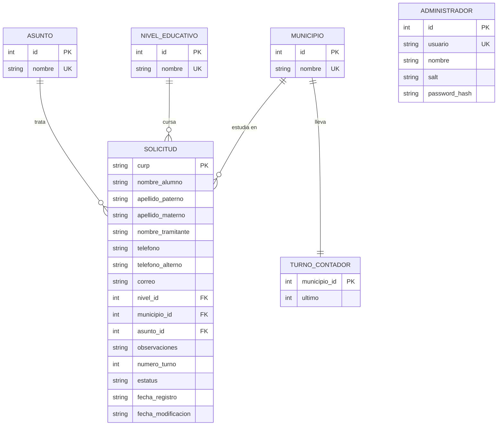

```mermaid
erDiagram
    MUNICIPIO ||--o{ SOLICITUD : "estudia en"
    NIVEL_EDUCATIVO ||--o{ SOLICITUD : "cursa"
    ASUNTO ||--o{ SOLICITUD : "trata"
    MUNICIPIO ||--|| TURNO_CONTADOR : "lleva"

    MUNICIPIO {
        int id PK
        string nombre UK
    }
    NIVEL_EDUCATIVO {
        int id PK
        string nombre UK
    }
    ASUNTO {
        int id PK
        string nombre UK
    }
    ADMINISTRADOR {
        int id PK
        string usuario UK
        string nombre
        string salt
        string password_hash
    }
    TURNO_CONTADOR {
        int municipio_id PK
        int ultimo
    }
    SOLICITUD {
        string curp PK
        string nombre_alumno
        string apellido_paterno
        string apellido_materno
        string nombre_tramitante
        string telefono
        string telefono_alterno
        string correo
        int nivel_id FK
        int municipio_id FK
        int asunto_id FK
        string observaciones
        int numero_turno
        string estatus
        string fecha_registro
        string fecha_modificacion
    }
```
